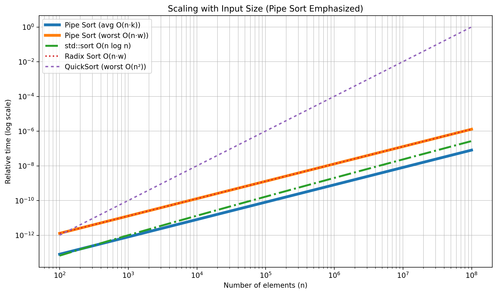
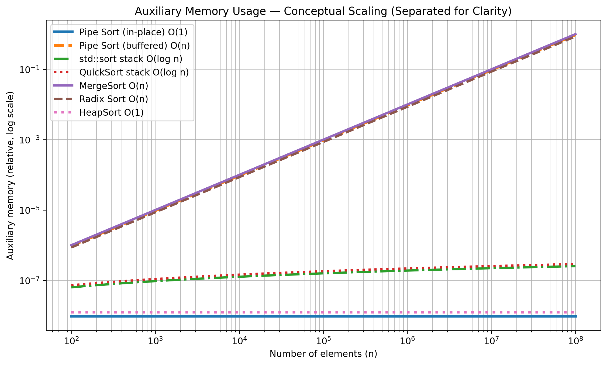

# Pipe Sort

**Pipe Sort** is a data-adaptive, comparison-free sorting algorithm designed for **wide integers** (128-bit and beyond). It is optimized for scenarios where traditional comparison-based sorting becomes expensive due to large key sizes and shared binary structure.

Pipe Sort is **not** a universal replacement for `std::sort`. It is a **specialized algorithm** with clearly defined strengths, trade-offs, and use cases.

---

## Motivation

Modern systems increasingly rely on wide keys:

* Cryptographic hashes and keys
* UUIDs and content-addressed identifiers
* Big integers (256 / 512 / 1024+ bits)

For such data, the cost of comparisons grows with key width. Pipe Sort approaches sorting from a different angle: it orders elements by **bit structure**, not by repeated key comparisons.

---

## Core Idea (Intuition)

Pipe Sort examines numbers **bit by bit**, starting from the most significant bit (MSB):

1. Elements are partitioned by the current bit (`0` or `1`)
2. If all elements share the same bit value, that bit is **skipped**
3. The process continues recursively on the next bit

This builds only the parts of a binary decision tree that are actually needed. The key insight is **prefix skipping**: identical high bits are never processed again.

No element-to-element comparisons are performed.

---

## Key Properties

* Comparison-free (bitwise partitioning only)
* MSB-first processing
* Data-adaptive via prefix skipping
* Optimized for multi-limb integers
* Predictable memory access patterns
* Naturally extensible to arbitrarily wide keys

---

## Time Complexity

Let:

* `n` = number of elements
* `w` = key width in bits
* `k` = number of effective bit levels actually examined (`k ≤ w`)

| Case         | Complexity                       |
| ------------ | -------------------------------- |
| Best case    | **O(n)** (large shared prefixes) |
| Average case | **O(n · k)** with `k ≪ w`        |
| Worst case   | **O(n · w)**                     |

Pipe Sort is **data-adaptive**: its runtime depends primarily on how much binary structure exists in the input.

---

## Space (Memory) Complexity

| Component             | Cost                             |
| --------------------- | -------------------------------- |
| In-place partitioning | **O(1)** auxiliary               |
| Buffered partitioning | **O(n)** auxiliary               |
| Recursion depth       | **O(w)** (or **O(1)** iterative) |

Memory usage is explicit and predictable.

---

## Performance Graphs

### 1. Scaling with Input Size

This graph shows how Pipe Sort scales as the number of elements increases.

* Solid thick lines represent Pipe Sort (average and worst case)
* `std::sort` is shown as a dot–dash baseline
* Other algorithms are included as thin dashed references

**Key takeaway:** Pipe Sort approaches linear behavior for many datasets while retaining a well-defined worst case.

---

### 2. Scaling with Key Width

This graph illustrates how runtime scales as key width increases (128 → 4096+ bits).

**Key takeaway:**

* Pipe Sort’s average behavior can remain near **O(n·k)** due to prefix skipping
* Worst-case behavior grows linearly with key width
* The algorithm generalizes naturally beyond `u128`

---

### 3. Auxiliary Memory Usage

This graph shows **auxiliary memory usage** (extra memory beyond the input array).

* Pipe Sort can operate **in-place (O(1))** or **buffered (O(n))**
* Other algorithms are shown for reference

**Key takeaway:** Pipe Sort offers predictable and controllable memory usage.

---

## Comparison Summary

| Algorithm     | Time (avg) | Time (worst) | Extra memory | Notes                                   |
| ------------- | ---------- | ------------ | ------------ | --------------------------------------- |
| **Pipe Sort** | O(n·k)     | O(n·w)       | O(1) / O(n)  | Best for wide keys with shared prefixes |
| `std::sort`   | O(n log n) | O(n log n)   | O(log n)     | Strong general-purpose baseline         |
| Radix Sort    | O(n·w)     | O(n·w)       | O(n)         | Fixed passes, not adaptive              |
| QuickSort     | O(n log n) | O(n²)        | O(log n)     | Worst case possible                     |

---

## When to Use Pipe Sort

* Sorting `u128` or larger integer types
* Keys are expensive to compare
* Data contains shared prefixes or duplicates
* Predictable scaling is preferred

## When *Not* to Use Pipe Sort

* Small primitive types (`u32`, `u64`)
* Very small input sizes
* Adversarial inputs designed to defeat prefix skipping

In such cases, `std::sort` is usually faster.

---

## Design Philosophy

Pipe Sort prioritizes:

* Clear cost models
* Explicit trade-offs
* Honest worst-case analysis

It is designed as a **specialized tool**, not a universal solution.

---

## Status

* Correctness verified
* Benchmarked against `std::sort`
* Implemented in C and C++
* Designed for extension to wider key sizes

---

## License

See `LICENSE` for details.

